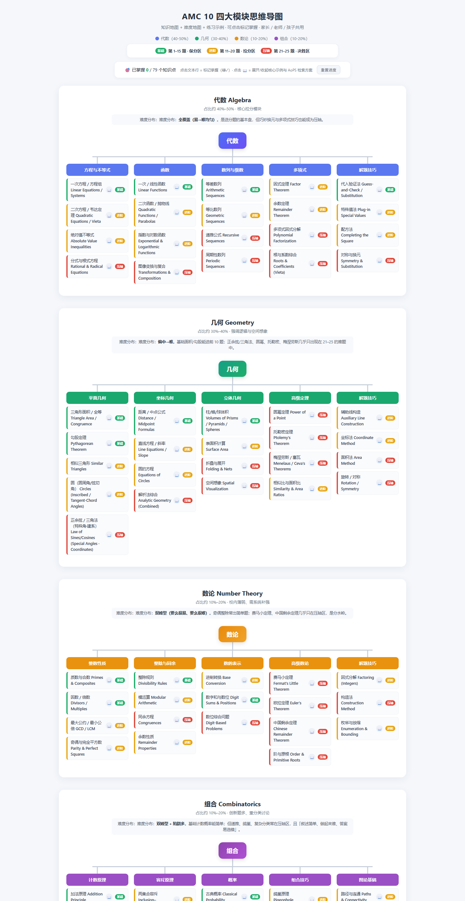

# AMC 10 四大模块思维导图 · 中英双语版

> 🧠 Knowledge map + difficulty map + interactive progress tracking for AMC 10.

[](https://zrrrr9527.github.io/amc10-mindmap/)
[](https://8d6ef495036e42299f84a2501f2773c2.app.codebuddy.work)
[](./README.md)

一个可交互的网页思维导图，覆盖 **AMC 10 四大模块：代数 / 几何 / 数论 / 组合**。每个知识点标注难度（基础 / 进阶 / 压轴），并配练习示例与 AoPS 真题检索入口，供学生、家长与老师共同推进备考。



## 🌐 在线体验

**推荐：** GitHub Pages 官方镜像（无需登录，稳定）：
https://zrrrr9527.github.io/amc10-mindmap/

备用体验：
https://8d6ef495036e42299f84a2501f2773c2.app.codebuddy.work

## ✨ 为什么用这个？

- **中英双语**：知识点名称中英对照，读英文教材/刷英文真题时不再混淆术语。
- **知识地图 + 难度地图**：四大模块 → 分支 → 知识点三级结构；每个知识点左侧色条与徽章标注 🟢 基础 / 🟡 进阶 / 🔴 压轴，对应 AMC 10 第 1–15 / 11–20 / 21–25 题。
- **点击标记掌握**：点一下知识点即标记「已掌握」（变绿打勾 + 顶部进度计数），使用 `localStorage` 持久化，刷新不丢失。
- **练习示例 + 真题检索**：点 📖 展开自编练习示例，并一键直达 **AoPS Wiki** 按该考点检索真实历年真题与解析。
- **全局手风琴折叠**：展开一个面板会自动收起其余，页面不会无限拉长。
- **零构建、零依赖**：纯 HTML + JS，直接打开即可用。

## 👥 适合谁用？

| 角色 | 使用方式 |
|------|---------|
| **学生** | 按模块逐一点亮已掌握的知识点，先做基础保分，再攻进阶和压轴。 |
| **家长** | 打开页面就能看到进度条，知道孩子哪些模块还薄弱，方便督促。 |
| **老师** | 把链接发给学生，作为备考路线图和课后跟踪工具。 |

## 🚀 快速开始

### 在线使用（推荐）
直接访问：https://zrrrr9527.github.io/amc10-mindmap/

### 本地运行
```bash
git clone https://github.com/Zrrrr9527/amc10-mindmap.git
cd amc10-mindmap
open index.html
```

无需任何构建工具、框架或网络依赖。

## 📁 文件结构

| 文件 | 说明 |
|------|------|
| `index.html` | 页面结构与交互逻辑 |
| `amc10_data.js` | 知识点数据（中英双语 + 难度 + 示例 + AoPS 检索关键词） |
| `preview.png` | 页面预览图 |
| `README.md` | 本说明 |

## 📝 说明

- 示例题为帮助理解考点的**自编练习**，并非某年特定真题；点击 📖 的检索按钮会直达 **AoPS Wiki** 站内搜索，找到对应考点的真实题目与多种解法。
- 数据可自由编辑：在 `amc10_data.js` 中，每个知识点形如
  ```js
  { t: "中文 English", lv: "easy|mid|hard", ex: "示例题", kw: "AoPS 检索词" }
  ```

## 📚 相关资源

- [AMC 10 历年真题](https://artofproblemsolving.com/wiki/index.php/AMC_10_Problems_and_Solutions) — AoPS 官方总库
- [AoPS Volume 1](https://artofproblemsolving.com/store/list/ams) — 经典备考教材

## 📄 许可

可免费用于个人学习与非商业教学。如需商用或二次分发，请保留出处。

---

如果对你有帮助，欢迎点个 ⭐，也欢迎转发给正在备考 AMC 10 的同学、家长或老师！
